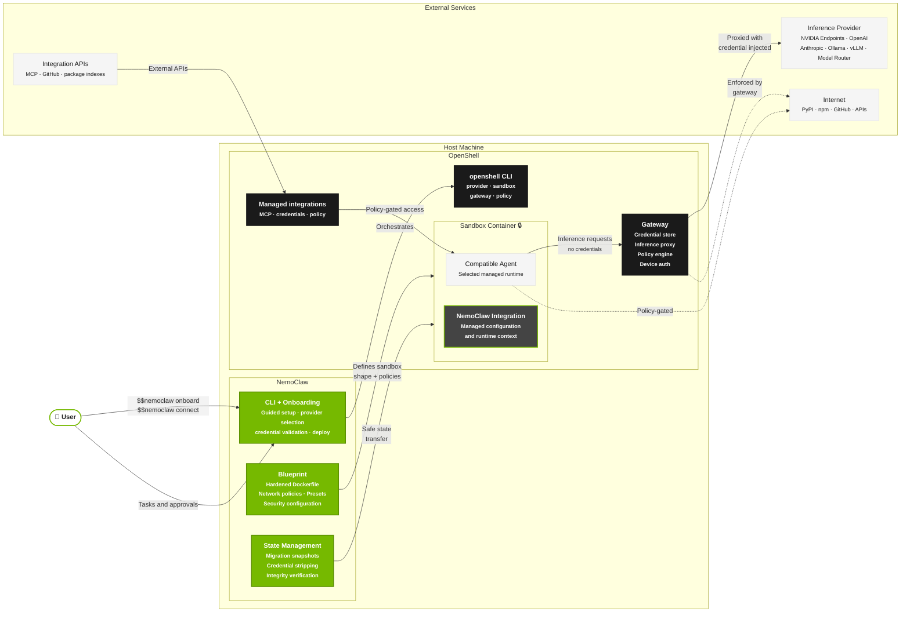
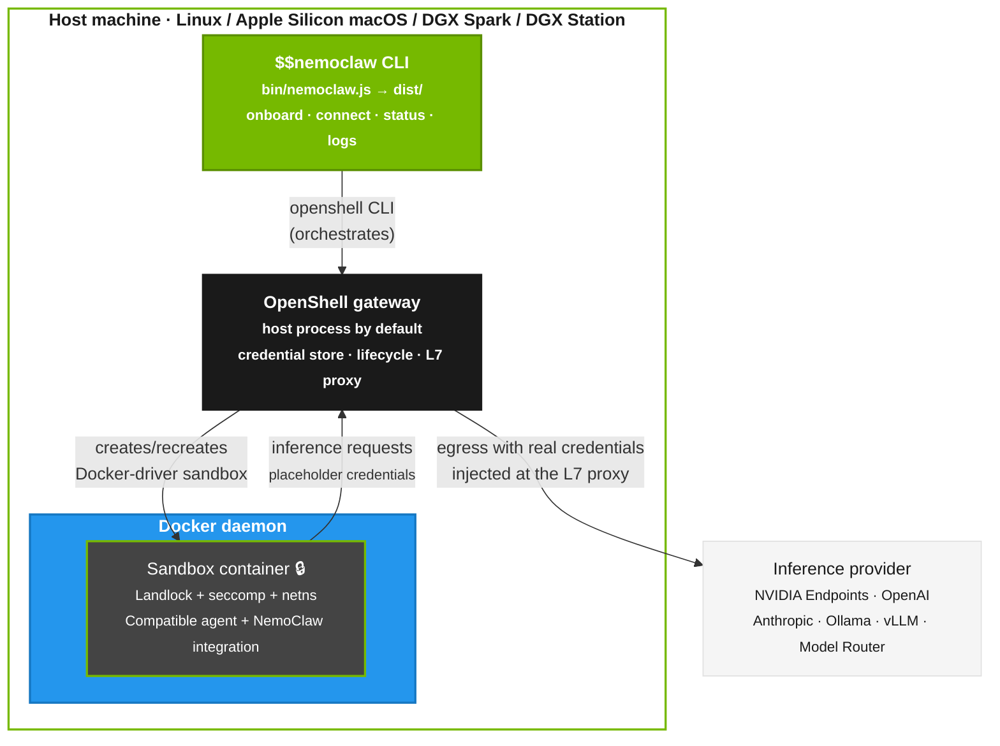
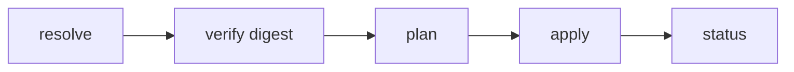

NemoClaw combines a host CLI, an in-sandbox integration layer, and a versioned YAML blueprint that defines the sandbox image, policies, and inference profiles applied through OpenShell.

## System Overview

NVIDIA OpenShell is a general-purpose agent runtime.
It provides sandbox containers, a credential-storing gateway, inference proxying, and policy enforcement, but it has no opinions about what runs inside.
NemoClaw is an opinionated reference stack built on OpenShell that handles what goes in the sandbox, prepares agent-specific integration, and makes the setup accessible.



## Deployment Topology

The logical diagram above shows how components relate.
This section shows what actually runs where on the host.
NemoClaw's default Docker-driver topology does not place the sandbox in an embedded k3s cluster.
Only the default gateway port `8080` uses a NemoClaw-managed service.
On Linux, NemoClaw prefers the upstream package-managed `openshell-gateway.service`.
For tarball installs, the NemoClaw installer stages a marked user-level `nemoclaw-openshell-gateway.service` based on the upstream unit.
Onboarding validates and reuses a healthy selected service.
It enables or restarts the service when startup or verified runtime drift requires it, then checks gateway health.
The marked service generates the local OpenShell mTLS bundle and reads `$XDG_CONFIG_HOME/openshell/gateway.env`, or `~/.config/openshell/gateway.env` when `XDG_CONFIG_HOME` is not absolute.
NemoClaw preserves unrelated environment entries, accepts `DOCKER_HOST` only for an absolute local `unix://` socket, and refuses foreign or symlinked managed files.
The standalone Linux process is used only when the systemd user manager is unavailable; after a service is selected, startup or health failure stops onboarding.
On Apple Silicon macOS, Homebrew makes the official OpenShell formula authoritative.
The installer stages the formula and onboarding starts its `openshell` service.
When Homebrew is present, a missing formula, a formula from another tap, a service-start failure, or a health failure stops onboarding.
Only a host without Homebrew uses the standalone macOS gateway fallback.
NemoClaw-managed gateways on custom ports remain detached and separate from the default service.
An externally supervised gateway can use any matching configured port; its declared supervisor retains lifecycle authority.
In both Docker-driver modes, the sandbox is a Docker container, not a Kubernetes pod.
Entrypoint supervisors create the in-container `/tmp/nemoclaw-gateway-local` marker only when they actually launch an in-container gateway, and they normally keep it present while that supervisor is active.
On normal exits, handled `SIGTERM`/`SIGINT`, startup failures, and shell `errexit` termination through the `EXIT` trap, the supervisor removes the marker on a best-effort basis so the Docker health check does not keep trusting a stale gateway PID.
Terminal runtimes may not write it.
NemoClaw does not treat sandbox environment hints such as `OPENSHELL_DRIVERS` as authoritative for gateway ownership.
Legacy non-Docker-driver installs still use the k3s-based gateway path.
In that topology, the `openshell-cluster-nemoclaw` container runs an embedded k3s cluster that includes the OpenShell gateway, an `agent-sandbox-controller` workload, and a Kubernetes custom resource definition named `sandboxes.agents.x-k8s.io`.
Each NemoClaw sandbox appears as a `Sandbox` custom resource in the `openshell` namespace, and the controller reconciles that resource into the corresponding agent pod.
For example, `kubectl get sandboxes.agents.x-k8s.io -n openshell` inside the legacy cluster container lists the sandbox resources, and `kubectl describe pod -n openshell <sandbox-pod>` reports `Controlled By: Sandbox/<name>`.
That Kubernetes resource path is a legacy implementation detail of the non-Docker-driver gateway, and it is not present in the default Docker-driver topology.

The diagram below shows the standard Docker-driver topology.



Layering from top to bottom:

| Layer | Runs as | Role |
|---|---|---|
| Host CLI | Host process (`$$nemoclaw` on Node.js) | Orchestrates OpenShell via `openshell` CLI calls. |
| OpenShell gateway | Host process by default; optional Linux compatibility container when the gateway binary needs a newer host ABI | Hosts the credential store, owns sandbox lifecycle coordination, and provides the L7 proxy. |
| Docker daemon | Host service | Runs the Docker-driver sandbox container and, on affected Linux hosts, the optional gateway compatibility container. |
| Sandbox container | Docker container | Runs the selected compatible agent and NemoClaw integration under Landlock + seccomp + netns. |
| OpenShell L7 proxy | Gateway process | Intercepts agent egress and rewrites `Authorization` headers (Bearer/Bot) and URL-path segments to inject the real credential at the network boundary. |

NemoClaw never gives the sandbox a raw provider key.
At onboard time it registers credentials with OpenShell's provider/placeholder system, and the L7 proxy substitutes the real value into outbound requests at egress.
The CLI helper `isInferenceRouteReady` (in `src/lib/onboard.ts`) is a host-side readiness check used by the resume flow to decide whether the active route already covers the chosen provider and model.
It is not a runtime component.

For the DGX Spark-specific variant of this topology (cgroup v2, aarch64, unified memory), refer to the [NVIDIA Spark playbook](https://build.nvidia.com/spark/nemoclaw).

## NemoClaw Agent Integration

NemoClaw integrates with each supported agent through a runtime layer that adapts the agent to OpenShell-managed providers, policies, and sandbox state.
The concrete files differ by agent because each runtime has its own plugin system, config format, state layout, and startup command.

| Agent | Integration files | Runtime behavior |
|---|---|---|
<AgentOnly variant="openclaw">
| OpenClaw | `nemoclaw/openclaw.plugin.json`, `nemoclaw/src/runtime-context.ts`, and the TypeScript package under `nemoclaw/src/` | Registers the `/nemoclaw` slash command, adds the NemoClaw inference provider, and injects sandbox and policy context into OpenClaw turns. |
</AgentOnly>
<AgentOnly variant="hermes">
| Hermes | `agents/hermes/manifest.yaml`, `agents/hermes/plugin/plugin.yaml`, `agents/hermes/generate-config.ts`, `agents/hermes/config/`, and `agents/hermes/start.sh` | Declares the Hermes agent contract, installs the NemoClaw Hermes plugin, writes `/sandbox/.hermes/config.yaml` and `/sandbox/.hermes/.env`, and launches `hermes gateway run` behind the OpenShell proxy. |
</AgentOnly>
<AgentOnly variant="deepagents">
| Deep Agents | `agents/langchain-deepagents-code/manifest.yaml`, `agents/langchain-deepagents-code/generate-config.ts`, `agents/langchain-deepagents-code/start.sh`, and the managed `dcode` launchers | Declares the terminal agent contract, writes `/sandbox/.deepagents/config.toml`, installs managed wrappers for `dcode` and `dcode -n`, and routes inference through `inference.local`. |
</AgentOnly>

<AgentOnly variant="openclaw">
The OpenClaw integration is a thin TypeScript plugin that runs in-process with the OpenClaw gateway inside the sandbox.
Its durable entry points are `nemoclaw/src/index.ts`, `nemoclaw/src/runtime-context.ts`, and `nemoclaw/openclaw.plugin.json`.
The `nemoclaw/src/commands/` directory contains in-sandbox `/nemoclaw` command handlers and migration helpers.
The `nemoclaw/src/blueprint/` directory contains runner, state, snapshot, SSRF, and private-network validation code.
Before an OpenClaw turn starts, the plugin prepends a short system-context block with the active sandbox name, sandbox phase, network policy summary, and filesystem policy summary.
This guidance stays out of the visible chat transcript.
When the policy or phase changes during a session, the plugin sends a smaller update block instead of repeating the full context.
The context tells the agent to try allowed network and filesystem operations before reporting them unavailable, and to distinguish policy denials from DNS, timeout, TLS, or filesystem errors.
</AgentOnly>

<AgentOnly variant="hermes">
The Hermes integration follows the generic agent-manifest path instead of the OpenClaw plugin package path.
The manifest declares Hermes' binary, health probe, config directory, state directories, and OpenAI-compatible API endpoint.
Messaging channel availability is declared by each channel manifest's `supportedAgents` list under `src/lib/messaging/channels/`, not by the Hermes agent manifest.
The build-time config generator turns NemoClaw onboarding choices into Hermes YAML and environment files, and the Hermes plugin manifest exposes NemoClaw tools and an `on_session_start` hook.
</AgentOnly>
<AgentOnly variant="deepagents">
The Deep Agents integration follows the generic agent-manifest path for terminal runtimes.
The manifest declares the `dcode` binary, smoke checks, config directory, state directories, and OpenAI-compatible inference route.
The build-time config generator turns NemoClaw onboarding choices into `config.toml`, and the managed launchers enforce the supported credential, MCP, tracing, and sandbox boundaries before `dcode` starts.
</AgentOnly>

## NemoClaw Blueprint

The blueprint is a versioned YAML package with its own release stream.
The runner resolves, verifies, and applies the blueprint through the OpenShell CLI.
The blueprint defines the sandbox shape, default policies, and inference profiles; the runner performs the OpenShell operations.

```text
nemoclaw-blueprint/
├── blueprint.yaml                  Manifest: version, profiles, compatibility
├── model-specific-setup/           Agent-scoped model/provider compatibility manifests
├── router/                         Model Router config and routing engine
├── policies/
│   └── presets/                    Shared policy presets
```

The blueprint schema and runner enforce these name constraints before the runner invokes OpenShell:

| Field | Constraint |
|---|---|
| `components.sandbox.name` | Use 1–63 lowercase letters, numbers, or internal hyphens, starting with a letter and ending with a letter or number. |
| `components.inference.profiles.<profile>.provider_name` | Use 1–128 letters, numbers, dots, underscores, or hyphens, starting with a letter. |

<AgentOnly variant="openclaw">
The default OpenClaw policy starts from `nemoclaw-blueprint/policies/openclaw-sandbox.yaml`.
</AgentOnly>
<AgentOnly variant="hermes">
Hermes keeps its agent-owned image, plugin, config, entrypoint, and policy additions under `agents/hermes/`.
The default Hermes policy starts from `agents/hermes/policy-additions.yaml`.
</AgentOnly>
<AgentOnly variant="deepagents">
Deep Agents keeps its agent-owned image, config generator, entrypoint, wrappers, and policy additions under `agents/langchain-deepagents-code/`.
The default Deep Agents policy starts from `agents/langchain-deepagents-code/policy-additions.yaml`.
</AgentOnly>

The current blueprint runner implementation lives in the `nemoclaw/` TypeScript package:

```text
nemoclaw/src/blueprint/
├── runner.ts                       CLI runner: plan / apply / status / rollback
├── ssrf.ts                         SSRF endpoint validation (IP + DNS checks)
├── private-networks.ts             Shared private-network block list loader for SSRF checks
├── snapshot.ts                     Migration snapshot / restore lifecycle
├── state.ts                        Persistent run state management
```

### Blueprint Lifecycle



1. Resolve. The integration layer locates the blueprint artifact and checks the version against the OpenShell and agent runtime constraints in `blueprint.yaml`.
2. Verify. The integration layer checks the artifact digest against the expected value.
3. Plan. The runner determines what OpenShell resources to create or update, such as the gateway, providers, sandbox, inference route, and policy.
4. Apply. The runner executes the plan by calling `openshell` CLI commands.
5. Status. The runner reports current state.

### Experimental Runtime Identity

The direct OpenClaw blueprint runner can opt in to a provider-neutral runtime identity component.
The Hermes manifest onboarding path does not consume this component.
This experimental reference capability is not enabled by the shipped blueprint, and normal `$$nemoclaw onboard` does not collect or provision its inputs.
The bundled Okta profile is the first data-only implementation of the component.
The blueprint schema describes the OpenShell provider binding and OAuth refresh inputs without using the identity provider as a schema discriminator.

<Warning>
  Runtime identity profiles may use DNS-backed HTTPS only within a provider type's repository-reviewed hostname suffixes.
  NemoClaw resolves every destination before import and rejects private or internal addresses.
  OpenShell performs connect-time SSRF and L7 enforcement for sandbox requests before it injects the provider credential.
  OpenShell 0.0.85's gateway-side OAuth refresh client enforces HTTPS and verifies the original hostname's certificate but does not pin the address NemoClaw resolved, so only identity-platform-controlled DNS suffixes such as `okta.com` belong in this trust table.
  Adding an attacker-controlled or customer-controlled DNS suffix requires a pinning-capable upstream refresh boundary and new conformance evidence.
</Warning>

#### Threat Model and Conformance Evidence

Runtime identity is opt-in only when a direct-runner blueprint includes `components.identity`; there is no implicit activation path.
The host process that supplies the named OAuth bootstrap variables and the authenticated OpenShell gateway are trusted.
The blueprint, copied profile, same-name gateway resources, sandbox workload, subprocess output, persisted state, and CI artifacts are treated as untrusted or observable surfaces.
The runner therefore validates the complete data-only profile before import, fails closed on ambiguous resource inspection, scopes secret material to the single refresh-configuration subprocess, and persists only non-secret ownership receipts.
OpenShell remains responsible for credential custody, refresh, admitted-request enforcement, and bearer substitution; NemoClaw never exposes the minted bearer to the sandbox.

The deterministic `TC-INF-12` protected E2E scenario is the conformance gate for this boundary.
It runs the real blueprint runner against a real OpenShell gateway and sandbox, enables provider-derived policy for the test and restores its prior setting, exchanges a refresh token through a public HTTPS OAuth endpoint, proves the sandbox sees only opaque placeholders, proves a child launched after rotation receives a different revision-scoped placeholder, proves the protected resource receives the first and rotated bearers, checks secret-free plan, status, state, logs, and request ledgers, and verifies ownership-aware rollback.
Focused runner and runtime-identity tests cover malformed profiles, endpoint and DNS rejection, subprocess scoping, same-name resource handling, partial-apply compensation, and retryable rollback receipts.
The gateway refresh client's connect-time DNS-pinning limitation described above is the accepted residual boundary; expanding the trusted hostname policy requires upstream pinning and new conformance evidence.

Enable provider-derived policy on the target gateway before applying a blueprint that attaches this component:

```bash
openshell settings set --global --key providers_v2_enabled --value true --yes
```

Apply reads the gateway-global setting before identity mutation and again immediately before attachment, and stops unless its JSON value is exactly `true`.
This prevents a successful-looking attachment whose provider-derived network policy and credential injection are inactive.

Copy `nemoclaw-blueprint/provider-profiles/okta-runtime-v1.yaml` into the blueprint you operate as `provider-profiles/acme-okta-runtime.yaml`.
You can choose another tenant-specific filename, but set `profile_path` below to that exact relative path.
Set its `token_url` to the tenant's authorization-server token endpoint.
Replace `api.example.okta.com` with the approved upstream API host.
Keep the token endpoint and upstream host in the profile so refresh material and bearer-token presentation cannot be redirected by blueprint input.

Configure the reference under `components`:

```yaml
identity:
  profile_path: provider-profiles/acme-okta-runtime.yaml
  provider_type: okta-runtime-v1
  provider_name: acme-okta-runtime
  credential_key: OKTA_ACCESS_TOKEN
  client_id_env: OKTA_CLIENT_ID
  refresh_token_env: OKTA_REFRESH_TOKEN
  client_secret_env: OKTA_CLIENT_SECRET
```

`client_secret_env` is optional, but when it is configured its environment variable must be present.
Secret-material environment names must equal one of `API_KEY`, `TOKEN`, `SECRET`, `PASSWORD`, or `CREDENTIAL`, or end in one of those terms preceded by an underscore.
Subprocess-control names such as `NODE_OPTIONS` and names forwarded by the general subprocess allowlist, such as the `OPENSHELL_`, `GRPC_`, and `XDG_` prefixes, are rejected.
The profile path must name an existing regular file whose resolved path stays inside the blueprint directory; absolute paths, outward traversal, and outward symlinks are rejected.
The profile `id` must match `provider_type`, and the profile must declare exactly one credential whose name matches `credential_key`.
Before import, the runner validates the complete credential-delivery policy and rejects unknown fields.
The Okta reference requires bearer presentation through the `authorization` header, the reviewed OAuth refresh-material shape, enforced REST `GET /**` endpoint rules, and exactly the bundled Node.js and curl executable allowlist.
The runner imports a private temporary snapshot of the exact profile bytes that passed validation, so replacing the original file or its symlink cannot change the policy OpenShell receives.
Before importing the profile, the runner requires HTTPS refresh and endpoint destinations, restricts them to the provider type's trusted host policy, and sends each through NemoClaw's DNS-aware SSRF boundary; private, loopback, link-local, and unresolved destinations are rejected.
DNS-backed destinations require an explicit reviewed policy marking their namespace as identity-platform-controlled; other profile policies reject them before import.
The current `okta-runtime-v1` policy accepts `okta.com` and its subdomains; custom Okta domains are not supported in this slice.
The same reviewed policy fixes the non-secret client ID source to `OKTA_CLIENT_ID`; a blueprint cannot select another host variable, and command failures redact the client ID value along with secret refresh material.
Before applying the blueprint, export the named environment variables in the host process that runs the direct blueprint runner.
Obtain the refresh token through an authorized OAuth bootstrap flow for the same Okta client and authorization server as the profile.
`openshell gateway login` authenticates a CLI user to the gateway and is not part of this runtime-credential flow.

During plan, the runner reports only the non-secret provider type, provider name, and credential key.
During apply, the runner first inspects the target sandbox and stops before identity mutation unless it confirms the exact name and `Ready` phase or an explicit sandbox-not-found result.
If sandbox creation races with another creator, the runner repeats the same exact-name and `Ready` inspection before continuing.
It performs that inspection again immediately before attaching the runtime identity, after inference routing is confirmed, and compensates without attachment if the sandbox changed.
The runner always inspects the configured inference provider before identity mutation, whether it will create or reuse the sandbox.
It reuses that inference provider only when its reported name, type, and required non-secret key shape match the blueprint, and permits creation only after an explicit provider-not-found result.
If creation then reports that another actor created the provider concurrently, the runner repeats the same binding inspection before treating it as unowned reusable state.
Any other inference-provider inspection failure stops apply.
The runner then inspects the requested runtime identity provider name and stops if any same-name provider already exists.
It validates an existing provider's non-secret binding to produce a precise error, but never reuses it for this mutable refresh flow because OpenShell does not expose a secret-safe snapshot that rollback could restore.
Only an absent provider proceeds to profile import, or exact export comparison when that profile is already registered, followed by provider creation, gateway-managed OAuth refresh configuration, and initial token rotation.
Before attaching that runtime identity to the sandbox, the runner creates or reuses the configured inference provider.
For a reused sandbox and provider, it reads the live gateway route and preserves it only when the provider, model, and any requested timeout match the blueprint; an absent or different route must pass `openshell inference set`.
This keeps the new credential attachment out of the sandbox until OpenShell has either reported the exact active route or accepted the requested route; only then does the runner attach the runtime identity and apply any policy additions.
Each successful apply therefore creates and owns the provider whose refresh state it mutates.
The persisted run plan records whether that apply created the runtime identity provider, its sandbox attachment, the inference provider, and the sandbox itself.
The runner writes that ownership receipt as each identity resource is acquired, so `status` and a later `rollback` retain a recovery path if automatic compensation fails.
If a later apply step fails, the runner detaches the runtime identity provider when that apply attached it, deletes each provider when that apply created it, and removes a sandbox created by that apply.
The runner never places the refresh token or optional client secret in command arguments or persisted plans.
It passes those values to `openshell provider refresh configure` through a scoped subprocess environment, and OpenShell stores the resulting credential material in the gateway credential store.
All other runner subprocesses receive the allowlisted environment without the identity material.
Each sandbox child launch receives an opaque `OKTA_ACCESS_TOKEN` placeholder, and the OpenShell L7 proxy substitutes its corresponding access token only for admitted HTTPS requests.
After a credential rotation, launch a new child process to receive the new revision-scoped placeholder instead of expecting an earlier child launch to adopt the rotation.

Check the gateway-side state without printing credential values:

```bash
openshell provider refresh status acme-okta-runtime --credential-key OKTA_ACCESS_TOKEN
openshell sandbox provider list <sandbox-name>
```

The direct runner `status` action reports the non-secret identity ownership receipt.
The `rollback` action verifies the current provider binding again, detaches it only when that apply created the sandbox attachment, and deletes it only when that apply created the provider.
Rollback stops and removes the sandbox only when the persisted plan proves that apply created it; reused sandboxes and legacy plans with unknown sandbox ownership are preserved.
After an owned sandbox is removed, or immediately when the sandbox was reused, rollback deletes the inference provider only when the persisted receipt proves that apply created it.
If removal of an apply-owned sandbox fails, rollback returns the bounded error without writing its completion marker, leaving the ownership receipt available for retry.
Rollback stops without mutating a same-name provider when the binding no longer matches the receipt.

Runtime identity does not add a generic blueprint middleware surface in this slice.
Configure any deployment-specific pre-credential policy through separately supported OpenShell tooling.
This reference does not package an OAuth bootstrap application, an on-behalf-of exchange, or a production identity middleware service.

## Sandbox Environment

<AgentOnly variant="openclaw,hermes">
Normal NemoClaw onboarding builds from the [`ghcr.io/nvidia/nemoclaw/sandbox-base`](https://github.com/NVIDIA/NemoClaw/pkgs/container/nemoclaw%2Fsandbox-base) base image and layers the NemoClaw runtime Dockerfile on top.
</AgentOnly>
<AgentOnly variant="deepagents">
Deep Agents onboarding builds from the agent-specific `agents/langchain-deepagents-code/Dockerfile.base` image and layers the managed Deep Agents runtime Dockerfile on top.
That base installs Node, Python, shell tools, and the hash-locked `deepagents-code` package needed by the terminal harness.
</AgentOnly>
<AgentOnly variant="openclaw">
The direct blueprint runner still carries a pinned OpenShell Community OpenClaw image for legacy `openshell sandbox create --from` compatibility.
</AgentOnly>
Inside the sandbox:

- The selected compatible agent runs with the NemoClaw integration layer installed or generated for that agent.
- Inference calls are routed through OpenShell to the configured provider.
- Network egress is restricted by the baseline policy for the selected agent profile.
- Filesystem access is confined to `/sandbox` and `/tmp` for read-write access, with system paths read-only.
<AgentOnly variant="openclaw">
- NemoClaw injects sandbox and policy context into agent turns when the selected agent supports runtime context hooks, so the agent can attempt allowed actions and report policy blocks or infrastructure failures accurately.
- The image exposes a Docker health check that probes the in-sandbox gateway, so container runtimes can report whether the agent service is responding.
</AgentOnly>
<AgentOnly variant="hermes">
- NemoClaw writes generated Hermes configuration into the sandbox, then the Hermes runtime exposes its own gateway and health surface.
- The image exposes health checks for the managed Hermes runtime.
</AgentOnly>
<AgentOnly variant="deepagents">
- NemoClaw writes generated Deep Agents configuration into the sandbox, then leaves interactive and headless execution to `dcode`.
- Deep Agents is a terminal runtime, so there is no long-running dashboard or gateway health surface inside the sandbox.
</AgentOnly>
<AgentOnly variant="openclaw,hermes">
- The image includes common runtime compatibility helpers such as Homebrew and a `python` to `python3` symlink for tools that still invoke `python`.
</AgentOnly>

## Inference Routing

Inference requests from the agent never leave the sandbox directly.
OpenShell intercepts them and routes them to the configured provider:

```text
Compatible agent (sandbox)  ──▶  OpenShell gateway  ──▶  Provider endpoint
```

When you select the Model Router provider, the OpenShell gateway routes to a host-side router process instead of a single upstream model.
The router selects from the configured pool, then calls the upstream NVIDIA endpoint with the credential held outside the sandbox.

Some model and provider combinations need agent-specific compatibility setup.
NemoClaw keeps those declarations under `nemoclaw-blueprint/model-specific-setup/<agent>/` so fixes for each supported agent can be tested and reviewed independently.

Refer to [Choose an Inference Provider](../inference/learn-and-choose/choose-inference-provider) for provider configuration details.

## Provider Credential Storage

Provider credentials live in the OpenShell gateway store, not on the host filesystem.
NemoClaw never writes them to host disk.
The OpenShell L7 proxy injects values at egress.
Refer to [Credential Storage](../security/credential-storage) for the inspection, rotation, and migration flow.

## Host-Side State and Config

NemoClaw keeps non-secret operator-facing state on the host rather than inside the sandbox.

| Path | Purpose |
|---|---|
| `~/.nemoclaw/sandboxes.json` | Registered sandbox metadata for the default gateway port, including the default sandbox selection. |
| `~/.nemoclaw/gateways/<port>/` | Segregated host state root (its own registry, snapshots, and legacy credential-migration files) for a non-default `NEMOCLAW_GATEWAY_PORT`. On upgrade, rows and related state move out of the legacy shared root only when their recorded gateway identity matches the selected port. Provider credentials remain in the OpenShell gateway store. The default gateway port uses the top-level `~/.nemoclaw/` location, so existing single-gateway hosts are unchanged. |
<AgentOnly variant="openclaw">
| `~/.openclaw/openclaw.json` | Host OpenClaw configuration that NemoClaw snapshots or restores during migration flows. |
</AgentOnly>

The following environment variables configure optional services and local access.

| Variable | Purpose |
|---|---|
| `NEMOCLAW_GATEWAY_PORT` | Optional host-side gateway port override for an independent OpenShell gateway and port-scoped NemoClaw state root. Supported for OpenClaw, Hermes, and Deep Agents. |
<AgentOnly variant="openclaw">
| `TELEGRAM_BOT_TOKEN` | Telegram bot token you provide before `$$nemoclaw onboard`. OpenShell stores it in a provider; the sandbox receives placeholders, not the raw secret. |
| `TELEGRAM_ALLOWED_IDS` | Comma-separated Telegram user or chat IDs for allowlists when onboarding applies channel restrictions. |
| `TELEGRAM_GROUP_POLICY` | OpenClaw Telegram group access policy: `open` by default, `allowlist` to require explicit group entries, or `disabled` to turn off OpenClaw group access. Hermes ignores this value. |
| `SLACK_BOT_TOKEN` | Slack bot token (`xoxb-...`) you provide before `$$nemoclaw onboard`. Stored as an OpenShell provider; never passed directly to the sandbox. |
| `SLACK_APP_TOKEN` | Slack app-level token (`xapp-...`) required for Socket Mode. Stored alongside `SLACK_BOT_TOKEN` during onboarding. |
| `SLACK_ALLOWED_USERS` | Comma-separated Slack member IDs for DM and channel `@mention` user allowlisting. |
| `SLACK_ALLOWED_CHANNELS` | Comma-separated Slack channel IDs where channel `@mention` events are enabled (e.g. `C012AB3CD,C987ZY6XW`). Baked into the sandbox image at build time. Combine with `SLACK_ALLOWED_USERS` to restrict both channel and member. |
| `CHAT_UI_URL` | URL for the optional chat UI endpoint. |
| `NEMOCLAW_DISABLE_DEVICE_AUTH` | Build-time-only toggle that disables gateway device pairing when set to `1` before the sandbox image is created. |
</AgentOnly>
<AgentOnly variant="hermes">
| `TELEGRAM_BOT_TOKEN` | Telegram bot token you provide before `$$nemoclaw onboard`. OpenShell stores it in a provider; the sandbox receives placeholders, not the raw secret. |
| `TELEGRAM_ALLOWED_IDS` | Comma-separated Telegram user or chat IDs for allowlists when onboarding applies channel restrictions. |
| `SLACK_BOT_TOKEN` | Slack bot token (`xoxb-...`) you provide before `$$nemoclaw onboard`. Stored as an OpenShell provider; never passed directly to the sandbox. |
| `SLACK_APP_TOKEN` | Slack app-level token (`xapp-...`) required for Socket Mode. Stored alongside `SLACK_BOT_TOKEN` during onboarding. |
| `SLACK_ALLOWED_USERS` | Comma-separated Slack member IDs for DM and channel `@mention` user allowlisting. |
| `SLACK_ALLOWED_CHANNELS` | Comma-separated Slack channel IDs where channel `@mention` events are enabled (e.g. `C012AB3CD,C987ZY6XW`). Baked into the sandbox image at build time. Combine with `SLACK_ALLOWED_USERS` to restrict both channel and member. |
</AgentOnly>
<AgentOnly variant="deepagents">
| `NEMOCLAW_POLICY_TIER` | Optional non-interactive policy tier selection during onboarding. |
| `TAVILY_API_KEY` | Host-side input for the optional managed Tavily provider. Register it with `$$nemoclaw credentials add tavily-search --type tavily --credential TAVILY_API_KEY` before attaching the provider to Deep Agents. |
</AgentOnly>

For normal setup and reconfiguration, prefer `$$nemoclaw onboard` over editing these files by hand.
<AgentOnly variant="openclaw">
Do not treat `NEMOCLAW_DISABLE_DEVICE_AUTH` as a runtime setting for an already-created sandbox.
</AgentOnly>
